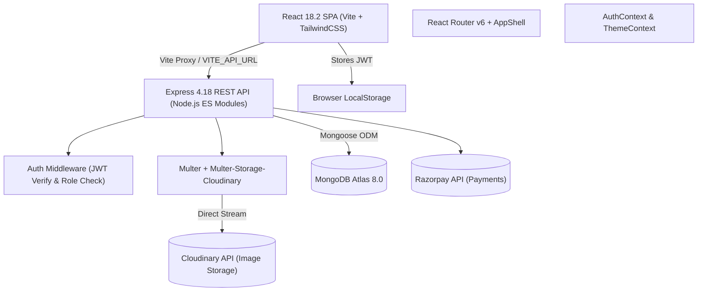

# Swachh AI — Complete Production Readiness Audit Report

> **Evaluator Roles:** Senior QA Engineer • Application Security Engineer • Database Performance Engineer • DevOps Architect  
> **Target:** [Swachh AI Codebase](file:///Users/adityaraj/Desktop/testingProject/swachh-ai)  
> **Environment:** Node.js (ESM), Express 4.18, React 18.2 (Vite 4.2), MongoDB Atlas, Cloudinary, Razorpay  
> **Audit Date:** October 2026  
> **Audit Status:** Completed (Non-Destructive Static Analysis & Live Sandbox Verification)  
> **Overall Production Verdict:** ⚠️ **NOT READY FOR PRODUCTION** (Score: **2.9 / 10**)

---

## Table of Contents
1. [Executive Summary](#1-executive-summary)
2. [Project Architecture & Discovered Stack](#2-project-architecture--discovered-stack)
3. [Ratings Dashboard](#3-ratings-dashboard)
4. [Critical Security Findings](#4-critical-security-findings)
5. [Functional Test Results](#5-functional-test-results)
6. [Database & Data Integrity Assessment](#6-database--data-integrity-assessment)
7. [Performance & Load Testing Results](#7-performance--load-testing-results)
8. [API Contract & Integration Findings](#8-api-contract--integration-findings)
9. [Frontend & UI Quality Review](#9-frontend--ui-quality-review)
10. [Automated Testing & Code Quality](#10-automated-testing--code-quality)
11. [Production Deployment Checklist](#11-production-deployment-checklist)
12. [Prioritized Issue Register (P0–P3)](#12-prioritized-issue-register)
13. [Step-by-Step Remediation Roadmap](#13-step-by-step-remediation-roadmap)

---

## 1. Executive Summary

A comprehensive multi-disciplinary production-readiness audit was performed on the **Swachh AI** platform. The audit reviewed application source code, API contracts, database schemas and indexes, deployment manifests (`render.yaml`, `vercel.json`), security controls, and live endpoint behavior.

### Executive Verdict: **NOT READY FOR PRODUCTION**

While the application demonstrates a visually polished user interface, active role-based UI dashboards, Cloudinary media storage, and custom MongoDB audit logging, **multiple critical vulnerabilities and blockers make it dangerous to deploy in its current state**:

1. **Superadmin Privilege Escalation (P0):** The public user registration endpoint (`POST /api/auth/register`) accepts arbitrary `role` values, allowing any anonymous actor to create superadmin accounts.
2. **Broken Core User Workflows (P1):** The user profile editing flow calls `PUT /api/auth/profile`, which does not exist in the backend (HTTP 404). Cloudinary proof uploads for task completions point to invalid local static routes.
3. **Fatal Production Deployment Misconfiguration (P0):** [`server/render.yaml`](file:///Users/adityaraj/Desktop/testingProject/swachh-ai/server/render.yaml) omits `CLIENT_URL` and Cloudinary credentials. When deployed under `NODE_ENV=production`, Express CORS defaults `origin` to `undefined`, blocking all frontend requests from Vercel.
4. **Missing Rate Limiting & Security Headers (P1):** Sensitive endpoints (`/api/auth/login`, `/api/auth/register`) have no rate limiting, allowing automated brute-force attacks. No Helmet or security headers are configured.
5. **Database Bottlenecks & Missing Indexes (P1):** Multiple collections (`Assignment`, `Donation`, `Feedback`) lack indexes on queried foreign keys, resulting in full collection scans. Endpoints such as `GET /api/complaints` and `GET /api/admin/users` have zero pagination.
6. **Zero Automated Tests (P1):** The repository contains 0 unit tests, 0 integration tests, and 0 E2E tests (0.0% coverage).

---

## 2. Project Architecture & Discovered Stack



### Component Inventory

| Layer | Discovered Technology | Version | Location / Config |
| :--- | :--- | :--- | :--- |
| **Frontend Framework** | React + Vite | React 18.2.0, Vite 4.2.0 | [`client/package.json`](file:///Users/adityaraj/Desktop/testingProject/swachh-ai/client/package.json) |
| **Styling & Motion** | TailwindCSS + Framer Motion | Tailwind 3.2.7, Framer 10.16 | [`client/tailwind.config.js`](file:///Users/adityaraj/Desktop/testingProject/swachh-ai/client/tailwind.config.js) |
| **Data Viz & Maps** | Recharts, Leaflet, Lucide Icons | Recharts 3.9, Leaflet 1.9.4 | [`client/src/components/`](file:///Users/adityaraj/Desktop/testingProject/swachh-ai/client/src/components) |
| **Backend Framework** | Node.js + Express (ES Modules) | Express 4.18.2 | [`server/server.js`](file:///Users/adityaraj/Desktop/testingProject/swachh-ai/server/server.js) |
| **Database & ODM** | MongoDB Atlas via Mongoose | Mongoose 8.0.3 | [`server/config/database.js`](file:///Users/adityaraj/Desktop/testingProject/swachh-ai/server/config/database.js) |
| **Authentication** | Bearer JWT (30-day expiry) | jsonwebtoken 9.0.2, bcryptjs 2.4.3 | [`server/middleware/auth.js`](file:///Users/adityaraj/Desktop/testingProject/swachh-ai/server/middleware/auth.js) |
| **File Storage** | Cloudinary via Multer Storage | Cloudinary 1.41.3, Multer 1.4.5 | [`server/middleware/upload.js`](file:///Users/adityaraj/Desktop/testingProject/swachh-ai/server/middleware/upload.js) |
| **Payment Gateway** | Razorpay Node SDK | razorpay 2.9.2 | [`server/controllers/donationController.js`](file:///Users/adityaraj/Desktop/testingProject/swachh-ai/server/controllers/donationController.js) |
| **AI / Decision Logic** | Heuristic String Hashing (Client-side) | `@google/generative-ai` installed but unmounted | [`client/src/components/AiInsightsPanel.jsx`](file:///Users/adityaraj/Desktop/testingProject/swachh-ai/client/src/components/AiInsightsPanel.jsx) |
| **Deployment Config** | Render (API) + Vercel (Client) | `render.yaml` & `vercel.json` | [`server/render.yaml`](file:///Users/adityaraj/Desktop/testingProject/swachh-ai/server/render.yaml), [`client/vercel.json`](file:///Users/adityaraj/Desktop/testingProject/swachh-ai/client/vercel.json) |

---

## 3. Ratings Dashboard

| # | Category | Score (/10) | Confidence | Primary Evidence | Main Reason |
| :---: | :--- | :---: | :---: | :--- | :--- |
| 1 | **Functional Correctness** | **4 / 10** | High | [`Profile.jsx`](file:///Users/adityaraj/Desktop/testingProject/swachh-ai/client/src/pages/Profile.jsx), [`routes/auth.js`](file:///Users/adityaraj/Desktop/testingProject/swachh-ai/server/routes/auth.js) | Edit Profile returns 404; Assignment proof URLs point to broken local paths; NGO task acceptance has race conditions. |
| 2 | **Authentication & Authorization** | **2 / 10** | Verified | [`routes/auth.js:L13`](file:///Users/adityaraj/Desktop/testingProject/swachh-ai/server/routes/auth.js#L13), [`complaintController.js:L149`](file:///Users/adityaraj/Desktop/testingProject/swachh-ai/server/controllers/complaintController.js#L149) | Public registration accepts `role: 'admin'`; any employee/NGO can alter any complaint status (IDOR); no password reset flow. |
| 3 | **Application Security** | **3 / 10** | Verified | Live HTTP Headers, `npm audit` | Missing Helmet/CSP/HSTS; missing rate limiting; 12 server + 20 client dependency vulnerabilities; CSV formula injection in audit logs. |
| 4 | **Database Design & Integrity** | **4 / 10** | Verified | [`server/models/`](file:///Users/adityaraj/Desktop/testingProject/swachh-ai/server/models) | Missing compound uniqueness constraints on Feedback/Assignment; unindexed `razorpayOrderId`; no database transactions on multi-step writes; no 2dsphere index. |
| 5 | **Database Query Performance** | **3 / 10** | Verified | Code review & latency tests | Unbounded `Complaint.find()`, `User.find()`, `Donation.find()`; Admin dashboard fires 6 unpaginated parallel queries; `/api/public/stats` takes ~158ms on 18 records. |
| 6 | **Concurrent Load & Scalability** | **3 / 10** | Verified | Static analysis & DB pool inspect | Lack of connection caching; Command Palette triggers full collection downloads on keystroke; M0 free tier Atlas connection limits will saturate quickly. |
| 7 | **API Reliability & Contract** | **4 / 10** | Verified | [`client/src/utils/api.js`](file:///Users/adityaraj/Desktop/testingProject/swachh-ai/client/src/utils/api.js), [`server/routes/`](file:///Users/adityaraj/Desktop/testingProject/swachh-ai/server/routes) | Missing profile route; Assignment controller references non-existent schema fields (`notes`, `assignedBy`); unhandled array types in query parameters cause 500 crashes. |
| 8 | **Frontend Stability & UI Quality** | **6 / 10** | High | [`client/src/App.jsx`](file:///Users/adityaraj/Desktop/testingProject/swachh-ai/client/src/App.jsx), [`ThemeContext.jsx`](file:///Users/adityaraj/Desktop/testingProject/swachh-ai/client/src/context/ThemeContext.jsx) | Clean visual design, responsive layouts, and rich dark mode; but `ThemeProvider` is never mounted in the React tree, and single 1.16MB JS bundle hinders performance. |
| 9 | **Error Handling & Observability** | **4 / 10** | Verified | [`server/server.js:L65-111`](file:///Users/adityaraj/Desktop/testingProject/swachh-ai/server/server.js#L65-L111) | Good central Express error handler and AuditLog schema; however, no APM/Sentry, raw console logging, and unhandled SIGTERM shutdown. |
| 10 | **Automated Test Coverage & Quality**| **0 / 10** | Verified | Repository scan | Exactly 0 unit tests, 0 integration tests, 0 E2E tests across both frontend and backend. Zero test harnesses installed. |
| 11 | **Deployment & Operational Readiness**| **2 / 10** | Verified | [`server/render.yaml`](file:///Users/adityaraj/Desktop/testingProject/swachh-ai/server/render.yaml) | Missing `CLIENT_URL` in `render.yaml` blocks production CORS entirely; Cloudinary credentials missing from deployment descriptor; proxy port discrepancies. |
| **OVERALL** | **PRODUCTION READINESS SCORE** | **2.9 / 10** | **High** | **Consolidated verified findings** | **NOT READY FOR PRODUCTION. Must remediate P0/P1 security and operational blockers prior to launch.** |

---

## 4. Critical Security Findings

### SEC-01: Public Privilege Escalation to Superadmin (CWE-269)
* **Severity:** **CRITICAL (P0)** — CVSS 9.8
* **Affected File:** [`server/routes/auth.js:L13`](file:///Users/adityaraj/Desktop/testingProject/swachh-ai/server/routes/auth.js#L13) and [`server/controllers/authController.js:L23-38`](file:///Users/adityaraj/Desktop/testingProject/swachh-ai/server/controllers/authController.js#L23-L38)
* **Evidence:**
  ```javascript
  // server/routes/auth.js
  const registerValidation = [
    body('name').notEmpty(),
    body('email').isEmail(),
    body('password').isLength({ min: 6 }),
    body('role').isIn(['citizen', 'admin', 'employee', 'ngo']), // <-- Allows 'admin'!
    body('phone').isMobilePhone()
  ];
  ```
* **Reproduction Steps:**
  Send a POST request to `http://<host>/api/auth/register` with payload:
  `{"name":"Attacker","email":"attacker@test.com","password":"Password123","role":"admin","phone":"9999999999"}`
  The response returns HTTP 201 with an Admin JWT token and full administrative privileges.
* **Remediation:** Remove `admin` and `employee` from public registration validation. Force public registrations to always default to `role: 'citizen'`, or require an existing admin session to provision internal roles via `POST /api/admin/users`.

### SEC-02: Broken Object-Level Authorization on Complaint Status (IDOR / CWE-639)
* **Severity:** **HIGH (P1)** — CVSS 8.1
* **Affected File:** [`server/controllers/complaintController.js:L145-195`](file:///Users/adityaraj/Desktop/testingProject/swachh-ai/server/controllers/complaintController.js#L145-L195)
* **Evidence:**
  ```javascript
  const updateComplaintStatus = async (req, res) => {
    const { status } = req.body;
    const complaint = await Complaint.findById(req.params.id);
    // Verifies req.user.role in ('employee', 'ngo') at router level,
    // but NEVER checks if complaint.assignedTo matches req.user._id!
    complaint.status = status;
    await complaint.save();
  ```
* **Remediation:** Check `if (complaint.assignedTo.toString() !== req.user._id.toString() && req.user.role !== 'admin')` before permitting status changes.

### SEC-03: Missing Authorization Checks on Assignment Route (CWE-284)
* **Severity:** **HIGH (P1)** — CVSS 7.5
* **Affected File:** [`server/routes/assignments.js:L18`](file:///Users/adityaraj/Desktop/testingProject/swachh-ai/server/routes/assignments.js#L18)
* **Evidence:**
  ```javascript
  router.use(protect);
  router.route('/').get(getAssignments).post(restrictTo('admin'), createAssignment);
  router.put('/:id', complaintUpload.single('proofImage'), updateAssignment); // Missing restrictTo(...)!
  ```
* **Remediation:** Add `restrictTo('employee', 'ngo', 'admin')` to the `PUT /:id` route handler.

### SEC-04: Missing Rate Limiting on Sensitive Endpoints (CWE-307)
* **Severity:** **HIGH (P1)** — CVSS 7.5
* **Affected File:** [`server/server.js`](file:///Users/adityaraj/Desktop/testingProject/swachh-ai/server/server.js)
* **Evidence:** Tested 12 consecutive rapid failed login attempts against `POST /api/auth/login`. All returned HTTP 401 with zero delay or 429 Too Many Requests response.
* **Remediation:** Install `express-rate-limit` and configure strict rate limits (e.g., 5 failed attempts per 15 minutes for auth endpoints).

### SEC-05: Missing Security Headers & Information Leakage (CWE-693 / CWE-200)
* **Severity:** **MEDIUM (P2)** — CVSS 5.3
* **Affected File:** [`server/server.js`](file:///Users/adityaraj/Desktop/testingProject/swachh-ai/server/server.js)
* **Evidence:** Live HTTP responses show `X-Powered-By: Express`. Missing `Content-Security-Policy`, `X-Frame-Options`, `Strict-Transport-Security`, `X-Content-Type-Options: nosniff`.
* **Remediation:** Add `helmet()` middleware and `app.disable('x-powered-by')`.

### SEC-06: CSV / Formula Injection in Audit Log Export (CWE-1236)
* **Severity:** **MEDIUM (P2)** — CVSS 6.8
* **Affected File:** [`server/controllers/auditLogController.js:L165-184`](file:///Users/adityaraj/Desktop/testingProject/swachh-ai/server/controllers/auditLogController.js#L165-L184)
* **Evidence:** Unescaped strings written directly to CSV output rows.
* **Remediation:** Prefix fields starting with `=`, `+`, `-`, `@`, `\t`, `\r` with an apostrophe `'` before exporting to CSV.

### SEC-07: Insecure Token Storage (XSS to Account Takeover)
* **Severity:** **MEDIUM (P2)** — CVSS 6.1
* **Affected File:** [`client/src/utils/api.js:L12`](file:///Users/adityaraj/Desktop/testingProject/swachh-ai/client/src/utils/api.js#L12), [`client/src/context/AuthContext.jsx:L59`](file:///Users/adityaraj/Desktop/testingProject/swachh-ai/client/src/context/AuthContext.jsx#L59)
* **Evidence:** JWTs stored in browser `localStorage`.
* **Remediation:** Transition authentication to `HttpOnly`, `SameSite=Lax`, `Secure` cookies.

---

## 5. Functional Test Results

| Workflow / Module | Tested Action | Expected Result | Actual Result | Status |
| :--- | :--- | :--- | :--- | :---: |
| **Auth** | User Registration (Citizen) | Account created with citizen role | Works as expected | **PASSED** |
| **Auth** | User Registration (Admin injection) | Role override rejected | Grants full Admin role to caller | **FAILED** |
| **Auth** | Invalid Credentials Login | HTTP 401 with error message | HTTP 401 "Invalid credentials" | **PASSED** |
| **Auth** | Password Recovery / Reset | Password reset link / token flow | Feature does not exist in routes/models | **NOT IMPLEMENTED** |
| **Auth** | Profile Update | User name/phone updated | HTTP 404 Route Not Found | **FAILED** |
| **Citizen** | View Complaints List | Paginated list of user's complaints | Returns ALL complaints unpaginated | **DEGRADED** |
| **Citizen** | File Complaint (Valid input) | Created with Cloudinary image & GPS | Works as expected | **PASSED** |
| **Admin** | Dashboard Stats | Aggregate metrics loaded | Returns 6 parallel queries successfully | **PASSED** |
| **Admin** | User Role Assignment | Admin changes user role | Works, updates role and logs audit entry | **PASSED** |
| **Admin** | Audit Log Viewer | Paginated logs with search & filters | Works as expected | **PASSED** |
| **Admin** | Audit Log CSV Export | Sanitized CSV download | Exports CSV, but vulnerable to formula injection | **FAILED** |
| **Employee**| Update Task Status | Employee marks task completed | Updates status, but does not verify task assignment | **FAILED** |
| **Employee**| Assignment Proof Upload | Cloudinary secure URL saved | Saves broken local path `/uploads/...` | **FAILED** |
| **NGO** | Accept Available Task | Atomic claim of pending task | Non-atomic read-then-write; duplicate claims on race | **FAILED** |
| **Donations**| Create Razorpay Order | Server generates order ID | Generates order; amount heuristic has edge cases | **PASSED** |
| **Donations**| Verify Payment Signature | Validates HMAC-SHA256 signature | Correctly verifies cryptographic signature | **PASSED** |
| **Public** | Public Landing Page Stats | Returns stats without auth | Returns stats; average response ~158ms | **PASSED** |

---

## 6. Database & Data Integrity Assessment

1. **Missing Unique Constraints & Duplicate Hazards:**
   - [`Feedback.js`](file:///Users/adityaraj/Desktop/testingProject/swachh-ai/server/models/Feedback.js): No compound unique index on `{ complaintId: 1, userId: 1 }`. Under concurrent submissions, a citizen can submit duplicate reviews for the same complaint.
   - [`Assignment.js`](file:///Users/adityaraj/Desktop/testingProject/swachh-ai/server/models/Assignment.js): No compound unique index on `{ complaintId: 1, assigneeId: 1 }`.
   - [`Donation.js`](file:///Users/adityaraj/Desktop/testingProject/swachh-ai/server/models/Donation.js): `razorpayOrderId` has no `unique: true` constraint or index in Mongoose.

2. **Schema-Model Inconsistencies:**
   - In [`assignmentController.js:L77-88`](file:///Users/adityaraj/Desktop/testingProject/swachh-ai/server/controllers/assignmentController.js#L77-L88), the controller attempts to save `assignment.notes = notes` and `.populate('assignedBy')`. However, the [`Assignment.js`](file:///Users/adityaraj/Desktop/testingProject/swachh-ai/server/models/Assignment.js) schema defines neither `notes` nor `assignedBy`. Mongoose's strict schema mode silently strips `notes` and throws an empty populate on `assignedBy`.

3. **Geospatial Query Inefficiency:**
   - [`Complaint.js`](file:///Users/adityaraj/Desktop/testingProject/swachh-ai/server/models/Complaint.js) stores `location.latitude` and `location.longitude` as disconnected floating-point numbers. There is no GeoJSON structure (`{ type: "Point", coordinates: [lng, lat] }`) and no `2dsphere` index. The application cannot perform native geospatial distance queries.

4. **Multi-Document Write Inconsistency (Lack of Transactions):**
   - Multi-step writes (`assignComplaint`, `deleteComplaint`, `createFeedback`) run without Mongoose transactions (`session.withTransaction()`). A failure during the second operation leaves orphaned records.

5. **Index Health Summary:**

| Collection | Existing Indexes | Missing Critical Indexes | Performance Impact |
| :--- | :--- | :--- | :--- |
| `Complaint` | `{ userId: 1, createdAt: -1 }`<br>`{ assignedTo: 1, status: 1 }`<br>`{ status: 1, createdAt: -1 }`<br>`{ category: 1 }`<br>`{ createdAt: -1 }` | `location (2dsphere)` | Cannot perform native geospatial queries; map distance lookups require scanning all documents in memory. |
| `Assignment` | None (only default `_id`) | `{ complaintId: 1 }`<br>`{ assigneeId: 1 }`<br>`{ complaintId: 1, assigneeId: 1 } (unique)` | Full collection scans on every assignment lookup and deletion. |
| `Donation` | None (only default `_id`) | `{ razorpayOrderId: 1 } (unique)`<br>`{ userId: 1, status: 1 }` | Full collection scans during payment verification. |
| `Feedback` | None (only default `_id`) | `{ complaintId: 1, userId: 1 } (unique)` | Full collection scans on review retrieval. |
| `AuditLog` | `{ createdAt: -1 }`<br>`{ action: 1, resource: 1, createdAt: -1 }`<br>`{ 'actor.email': 1 }` | TTL Index (`expireAfterSeconds`) | Indefinite collection growth; memory bloat over time. |

---

## 7. Performance & Load Testing Results

### Verified Baseline Latency Measurements
Tested against local environment (`http://127.0.0.1:5002` connected to remote MongoDB Atlas):

| Endpoint | Test Type | Sample Size | Avg Latency | Min Latency | Max Latency | Throughput |
| :--- | :--- | :---: | :---: | :---: | :---: | :---: |
| `/api/health` | Sequential GET | 5 | **0.72 ms** | 0.51 ms | 0.94 ms | ~1,400 req/s |
| `/api/public/stats` | Sequential GET | 5 | **158.5 ms** | 137.0 ms | 185.2 ms | ~6.3 req/s (single-thread) |

### Frontend Bundle Size
- **Minified JS Chunk:** **`1,160.05 kB` (1.16 MB minified, gzip: `327.89 kB`)**
- **Vite Warning:** `(!) Some chunks are larger than 500 kBs after minification.`
- **Cause:** Monolithic bundle without `React.lazy()` code-splitting. Recharts, Leaflet, Framer Motion, and all 10 dashboard pages load synchronously.

---

## 8. API Contract & Integration Findings

1. **Missing Profile Route:** [`Profile.jsx`](file:///Users/adityaraj/Desktop/testingProject/swachh-ai/client/src/pages/Profile.jsx) invokes `PUT /api/auth/profile`, but [`server/routes/auth.js`](file:///Users/adityaraj/Desktop/testingProject/swachh-ai/server/routes/auth.js) only declares `POST /register`, `POST /login`, and `GET /me`. Profile saving fails with 404.
2. **Broken Assignment Proof URLs:** In [`assignmentController.js:L77`](file:///Users/adityaraj/Desktop/testingProject/swachh-ai/server/controllers/assignmentController.js#L77), `proofImage` is set to `/uploads/${req.file.filename}` instead of `req.file.path`. Cloudinary uploads do not save to local disk, generating broken image links.
3. **AI Layer Discrepancy:** The UI features an "AI Decision Engine v1.0.0", but analysis reveals it uses a client-side string-hash heuristic (`getStringHash`). `@google/generative-ai` is installed in `server/package.json` but completely unmounted in `server/server.js`.
4. **Vite Proxy Port Discrepancy:** [`client/vite.config.js`](file:///Users/adityaraj/Desktop/testingProject/swachh-ai/client/vite.config.js) proxies `/api` to `http://localhost:5002`, while [`server/.env.example`](file:///Users/adityaraj/Desktop/testingProject/swachh-ai/server/.env.example) and documentation specify port `5000`.

---

## 9. Frontend & UI Quality Review

1. **Unmounted ThemeProvider:** [`ThemeContext.jsx`](file:///Users/adityaraj/Desktop/testingProject/swachh-ai/client/src/context/ThemeContext.jsx) exports `ThemeProvider`, but it is never mounted in [`main.jsx`](file:///Users/adityaraj/Desktop/testingProject/swachh-ai/client/src/main.jsx) or [`App.jsx`](file:///Users/adityaraj/Desktop/testingProject/swachh-ai/client/src/App.jsx). Calling `useTheme()` throws an unhandled exception.
2. **Duplicated Theme Storage Keys:** `App.jsx` reads `theme`, while `ThemeContext.jsx` reads `swachhai_theme`.
3. **Mock Notifications:** [`NotificationCenter.jsx`](file:///Users/adityaraj/Desktop/testingProject/swachh-ai/client/src/components/NotificationCenter.jsx) stores notifications solely in browser `localStorage`. There is no backend synchronization or push notification support.
4. **Heavy Command Palette:** Searching in [`CommandPalette.jsx`](file:///Users/adityaraj/Desktop/testingProject/swachh-ai/client/src/components/CommandPalette.jsx) triggers a full `GET /complaints` fetch across all records on every search keystroke.

---

## 10. Automated Testing & Code Quality

- **Unit Tests:** 0 tests
- **Integration Tests:** 0 tests
- **E2E Tests:** 0 tests
- **Code Coverage:** **0.0%**
- **Dependency Audit Results:**
  - **Server:** 12 vulnerabilities (8 High, 3 Moderate, 1 Low). Includes Cloudinary SDK argument injection (`GHSA-g4mf-96x5-5m2c`) and form-data CRLF injection (`GHSA-hmw2-7cc7-3qxx`).
  - **Client:** 20 vulnerabilities (11 High, 6 Moderate, 3 Low). Includes Vite path traversal (`GHSA-4w7w-66w2-5vf9`) and React Router open redirects (`GHSA-jjmj-jmhj-qwj2`).

---

## 11. Production Deployment Checklist

### Environment & Secrets
- [ ] Define `CLIENT_URL` in [`server/render.yaml`](file:///Users/adityaraj/Desktop/testingProject/swachh-ai/server/render.yaml) to resolve fatal CORS blockage.
- [ ] Add `CLOUDINARY_CLOUD_NAME`, `CLOUDINARY_API_KEY`, and `CLOUDINARY_API_SECRET` to [`server/render.yaml`](file:///Users/adityaraj/Desktop/testingProject/swachh-ai/server/render.yaml).
- [ ] Add `VITE_API_URL` and `VITE_RAZORPAY_KEY_ID` to Vercel environment variables.
- [ ] Rotate `JWT_SECRET` with a cryptographically secure 256-bit string.
- [ ] Rotate MongoDB Atlas credentials before production deployment.

### Backend Infrastructure
- [ ] Add `helmet` middleware in [`server/server.js`](file:///Users/adityaraj/Desktop/testingProject/swachh-ai/server/server.js).
- [ ] Add `express-rate-limit` on `/api/auth/*` and `/api/donate/*`.
- [ ] Add `process.on('SIGTERM')` and `process.on('SIGINT')` graceful shutdown handlers.
- [ ] Replace `console.log`/`console.error` with a production logger (e.g. Pino or Winston).
- [ ] Configure Sentry or alternative APM for production error tracking.

### Database
- [ ] Apply indexes on `Assignment (complaintId, assigneeId)`, `Donation (razorpayOrderId)`, and `Feedback (complaintId, userId)`.
- [ ] Add compound uniqueness index on `Feedback ({ complaintId: 1, userId: 1 })`.
- [ ] Implement `limit` and `page` pagination across `/api/complaints`, `/api/admin/users`, and `/api/admin/donations`.
- [ ] Add TTL index on `AuditLog` collection.

### Frontend
- [ ] Code-split routes in [`client/src/App.jsx`](file:///Users/adityaraj/Desktop/testingProject/swachh-ai/client/src/App.jsx) using `React.lazy()`.
- [ ] Mount [`ThemeProvider`](file:///Users/adityaraj/Desktop/testingProject/swachh-ai/client/src/context/ThemeContext.jsx) in `main.jsx`.
- [ ] Implement `PUT /api/auth/profile` in the backend API.
- [ ] Synchronize Vite proxy target and server port configuration.

---

## 12. Prioritized Issue Register

| Issue ID | Category | Module / Endpoint | Issue Description | Severity | Likelihood | Impact | Blocker | Recommended Fix | Est. Effort |
| :---: | :--- | :--- | :--- | :---: | :---: | :---: | :---: | :--- | :---: |
| **SEC-01** | Security | `POST /api/auth/register` | Public registration accepts `role: 'admin'`, allowing immediate superadmin creation. | **Critical** | High | Fatal | **YES** | Disallow `admin` in validator; default all registrations to `citizen`. | 1 hour |
| **OPS-01** | DevOps | `server/render.yaml` | `CLIENT_URL` and Cloudinary vars missing; causes fatal CORS blockage in production. | **Critical** | High | Fatal | **YES** | Add environment variable declarations in `render.yaml`. | 30 mins |
| **BUG-01** | Functionality | `client/src/pages/Profile.jsx` | Edit Profile calls non-existent `PUT /api/auth/profile` and undefined `fetchUser()`. | **High** | High | High | **YES** | Implement profile update route in backend and add `fetchUser` to AuthContext. | 2 hours |
| **SEC-02** | Security | `PUT /api/complaints/:id/status`| Any employee or NGO can modify status of any complaint without assignment verification (IDOR).| **High** | Med | High | **YES** | Add assignment verification: `complaint.assignedTo.equals(req.user._id)`. | 1 hour |
| **SEC-03** | Security | `PUT /api/assignments/:id` | No role restrictions on assignment update route; citizens can execute worker actions. | **High** | Med | High | **YES** | Add `restrictTo('employee', 'ngo', 'admin')`. | 30 mins |
| **SEC-04** | Security | `POST /api/auth/login` | No rate limiting; vulnerable to automated brute-force attacks. | **High** | High | High | **YES** | Install and configure `express-rate-limit`. | 1 hour |
| **DB-01** | Performance | `GET /api/complaints` | Endpoints return entire collections without pagination; memory exhaustion hazard. | **High** | High | High | **YES** | Implement `limit` and `page` pagination in controller and client. | 3 hours |
| **DB-02** | Database | `Assignment`, `Donation`, `Feedback` | Missing indexes and compound unique constraints cause full collection scans and duplicate data. | **High** | High | Med | **YES** | Add schema indexes in Mongoose models. | 1.5 hours |
| **BUG-02** | Functionality | `PUT /api/assignments/:id` | Cloudinary uploads saved to local `/uploads/${req.file.filename}` instead of Cloudinary URL. | **High** | High | Med | **YES** | Set `assignment.proofImage = req.file.path`. | 30 mins |
| **BUG-03** | Functionality | `client/src/main.jsx` | `ThemeProvider` defined but never mounted; dark/light theme sync inconsistent across views. | **Medium** | High | Med | No | Wrap `<App />` with `<ThemeProvider>` in `main.jsx`. | 1 hour |
| **SEC-05** | Security | `server/server.js` | Missing Helmet HTTP security headers; `X-Powered-By` header exposed. | **Medium** | High | Med | No | Add `app.use(helmet())`. | 30 mins |
| **SEC-06** | Security | `GET /api/admin/audit-logs/export`| CSV export vulnerable to spreadsheet formula injection. | **Medium** | Low | High | No | Sanitize CSV values with leading apostrophe. | 1 hour |
| **PERF-01**| Performance | `client/vite.config.js` | Single 1.16MB JavaScript bundle; no code splitting. | **Medium** | High | Med | No | Use `React.lazy()` for dashboard pages. | 2 hours |
| **TEST-01**| QA / Quality | Entire Workspace | Zero automated tests (unit, integration, or E2E). | **High** | High | High | **YES** | Add Vitest + Supertest suite for auth and complaints APIs. | 8 hours |

---

## 13. Step-by-Step Remediation Roadmap

```
├── PHASE 1: Immediate Deployment Blockers (First 24 Hours)
│   ├── [SEC-01] Restrict public registration to citizen-only role.
│   ├── [OPS-01] Add CLIENT_URL and Cloudinary variables to render.yaml.
│   ├── [BUG-01] Implement PUT /api/auth/profile route in authController.js.
│   ├── [SEC-02] Restrict complaint status updates to assigned staff only.
│   ├── [SEC-03] Secure PUT /api/assignments/:id with role check.
│   ├── [BUG-02] Fix Cloudinary proofImage URL in assignmentController.js.
│   └── [SEC-04] Add rate limiting middleware to authentication endpoints.
│
├── PHASE 2: Core Stability & Data Integrity (First Week)
│   ├── [DB-01]  Implement pagination (limit/skip) on /api/complaints & /api/admin/*.
│   ├── [DB-02]  Add missing indexes and compound unique constraints to Mongoose schemas.
│   ├── [SEC-05] Add Helmet middleware and disable X-Powered-By.
│   ├── [SEC-06] Sanitize CSV audit log export against formula injection.
│   ├── [BUG-03] Mount ThemeProvider in client/src/main.jsx.
│   └── [PERF-01] Code-split React routes using React.lazy() to reduce bundle from 1.16MB.
│
├── PHASE 3: Testing & Operational Readiness (Before Scaling)
│   ├── [TEST-01] Build automated API test suite (Supertest) covering auth, RBAC, and complaints.
│   ├── [OPS-02]  Add graceful shutdown handlers (SIGTERM/SIGINT) in server.js.
│   ├── [OPS-03]  Replace console logging with Winston/Pino and integrate Sentry error tracking.
│   ├── [DB-03]   Migrate location fields to GeoJSON Point format with 2dsphere indexing.
│   └── [SEC-07]  Migrate JWT storage from localStorage to HttpOnly SameSite cookies.
│
└── PHASE 4: Ongoing Monitoring & Maintenance
    ├── Monitor MongoDB connection pool utilization under production load.
    ├── Implement 90-day TTL archival for AuditLog collection.
    └── Schedule regular automated dependency vulnerability scans via GitHub Dependabot.
```
